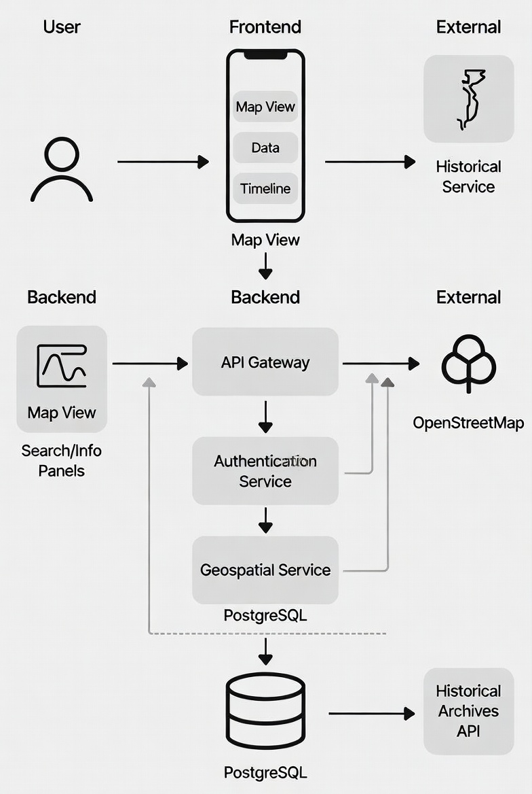

<h1 align="center">ỨNG DỤNG BẢN ĐỒ LỊCH SỬ VIỆT NAM</h1>

<div align="center">
  <p align="center">
    
  </p>
</div>

<h2 align="center">Hệ thống hiển thị và tra cứu địa điểm – sự kiện lịch sử trên nền bản đồ số</h2>

<p align="left">
Ứng dụng Bản đồ lịch sử Việt Nam là một dự án Web sử dụng <b>ReactJS</b>, <b>LeafletJS</b> để trực quan hoá địa điểm lịch sử theo thời kỳ trên bản đồ; <b>Node.js/Express</b> cung cấp API; dữ liệu không gian lưu ở <b>PostgreSQL/PostGIS</b>. Hệ thống hiển thị marker, popup, xem chi tiết (mô tả, ảnh, video, liên kết Wikipedia), lọc theo thời kỳ, tìm kiếm và đọc mô tả bằng giọng nói (Text-to-Speech).
</p>

<h1>🌟 GIỚI THIỆU</h1>

📌 Trực quan hoá dữ liệu lịch sử trên nền bản đồ tương tác (Leaflet).<br>
💡 Lọc theo thời kỳ / tìm kiếm theo từ khoá; xem chi tiết từng địa điểm (ảnh, video, sự kiện liên quan).<br>
🔊 Đọc mô tả địa điểm bằng giọng nói (TTS) với tuỳ chọn ngôn ngữ.<br>
🔗 Liên kết Wikipedia và mở định vị trên Google Maps.<br>
🧩 Dữ liệu không gian chuẩn GeoJSON, hậu thuẫn bởi PostGIS.

<h1>🏗️ HỆ THỐNG</h1>

<p align="center">
  
</p>

**Luồng tổng quát:**
1) Frontend (React) gọi `GET /api/places` ⇒ Backend (Express) truy vấn PostGIS ⇒ trả về GeoJSON.<br>
2) Leaflet hiển thị marker; click marker ⇒ gọi `GET /api/places/:id` ⇒ hiển thị Sidebar (ảnh, video, sự kiện, wiki).<br>
3) Bộ lọc `?period=...&q=...` giúp thu hẹp kết quả; ảnh/video lấy từ bảng `media`.

### 📂 Cấu trúc dự án

```
📦 history-map
├── 📂 backend
│   ├── index.js
│   ├── 📂 routes
│   │   └── places.js
│   ├── 📂 controllers
│   │   └── placesController.js
│   └── sample_data.sql
├── 📂 frontend
│   ├── 📂 src
│   │   ├── 📂 components
│   │   │   ├── MapView.jsx
│   │   │   └── Sidebar.jsx
│   │   ├── 📂 hooks
│   │   │   └── usePlaces.js
│   │   └── main.jsx / App.jsx
│   └── .env.example
└── README.md
```

<h1>🛠️ CÔNG NGHỆ SỬ DỤNG</h1>

<div align="center">

**📡 Backend:** Node.js, Express, pg (node-postgres), CORS  
**🗺️ GIS:** PostgreSQL + PostGIS, GeoJSON, LeafletJS  
**🖥️ Frontend:** React (Vite), Leaflet, Axios, Web Speech Synthesis API (TTS)  

</div>

<h1>🛠️ YÊU CẦU HỆ THỐNG</h1>

**🔌 Phần cứng**  
Máy tính cá nhân; kết nối Internet để tải bản đồ OSM/Wikimedia.

**💻 Phần mềm**
- Node.js 18+  
- PostgreSQL 14+ và PostGIS 3+  
- npm / pnpm / yarn (một trong ba)

<h1>📦 CÀI THƯ VIỆN & MÔI TRƯỜNG</h1>

### 1) Cơ sở dữ liệu
```sql
CREATE DATABASE history_map;
\c history_map;
CREATE EXTENSION postgis;
```
Chạy script dữ liệu mẫu:
```bash
psql -d history_map -f backend/sample_data.sql
```

### 2) Backend
```bash
cd backend
npm install
npm run start
```
API: http://localhost:8000

### 3) Frontend
```bash
cd frontend
npm install
npm run dev
```
Frontend: http://localhost:5173

<h1>🚀 HƯỚNG DẪN SỬ DỤNG NHANH</h1>

1️⃣ Mở frontend trong trình duyệt.<br>
2️⃣ Marker hiển thị theo dữ liệu `places`.<br>
3️⃣ Click marker → xem chi tiết trong Sidebar.<br>
4️⃣ Lọc / tìm kiếm / đọc giọng nói / mở Wikipedia.

<h1>🧪 API CHÍNH</h1>

**Lấy toàn bộ địa điểm (GeoJSON)**
```
GET /api/places?period={text}&q={text}
```
**Lấy chi tiết một địa điểm**
```
GET /api/places/:id
```

<h1>🧰 KHẮC PHỤC SỰ CỐ PHỔ BIẾN</h1>

- Ảnh lỗi `ERR_NAME_NOT_RESOLVED` → dùng link Wikimedia.  
- Lỗi kết nối → kiểm tra port 8000, .env, CORS.  
- Lỗi GeoJSON → đảm bảo `ST_AsGeoJSON(geom)` hợp lệ.  

<h1>🤝 ĐÓNG GÓP</h1>

Dự án được phát triển bởi sinh viên:

- **TRẦN CHIẾN THỊNH**    

© 2025 CNTT16-05, TRƯỜNG ĐẠI HỌC ĐẠI NAM
